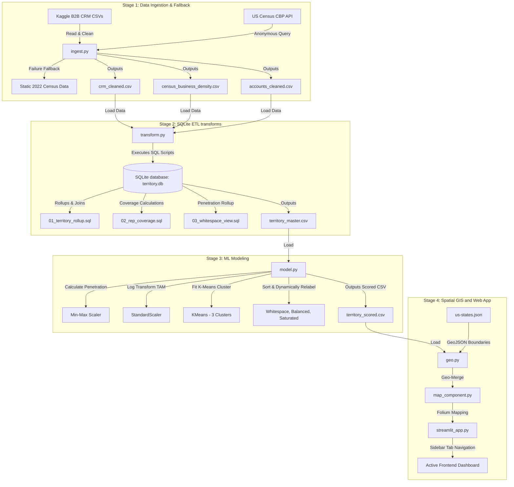

# 🗺️ B2B Sales Territory Optimiser & Whitespace Analyser
### Comprehensive Project Briefing, Technical Architecture, and Step-by-Step Walkthrough

This document briefs the intent, datasets, algorithms, architectural pipeline, and accomplishments of the **B2B Sales Territory Optimiser & Whitespace Analyser** dashboard. It acts as a guide to align business analysts and developers on the mechanics of the geo-analytics platform.

---

## 1. Project Intent & Business Objective

In B2B sales management (particularly for equipment, industrial pumps, and water utilities), allocating human capital to geographic territories is a critical driver of marginal revenue. Sales departments face a constant challenge: **How do we identify where unserved market demand exists, and where are our resources currently over-allocated?**

To solve this, the application creates a data-driven territory classification framework:
- **Whitespace (High Opportunity / Under-staffed)**: Regions characterized by a high density of potential business buyers (large addressable market) but low active sales representative headcounts and low historical won revenue. Staffing new reps here yields the highest ROI.
- **Balanced (Stable / On-Target)**: Regions where historical sales volume and sales force headcounts match the scale of the addressable market.
- **Saturated (Low Growth / Fully Staffed)**: Regions where representative density and sales volumes have hit diminishing returns relative to the capacity of the local market.

---

## 2. Technical Architecture & Data Flow

The platform is built as a modular 5-stage pipeline, merging CRM sales records with US Census county business patterns to segment and map territories.



---

## 3. Datasets Used

The platform utilizes three core datasets:

| Dataset | Origin | Key Columns | Purpose |
| :--- | :--- | :--- | :--- |
| **B2B CRM Pipeline** | Kaggle | `sales_agent`, `account_name`, `revenue`, `deal_stage`, `close_date`, `engage_date` | Measures historical sales performance, active opportunities, and deal closure rates. |
| **US Census CBP** | US Census API (2022 CBP) | `ESTAB` (Establishments), `EMP` (Employees), `PAYANN` (Annual Payroll) | Proxy for Total Addressable Market (TAM) capacity per state. |
| **US State Boundaries** | US Census Boundary JSON | `name`, `geometry` (multipolygon shape coordinate sets) | Drives Leaflet geographic polygon rendering on the maps. |

### Geospatial Mapping Mismatch Resolution
Because the Kaggle CRM dataset lacks state and zip code columns, the pipeline maps accounts to US states deterministically matching their representative's regional office during the ingestion step (`ingest.py`):
- **West Reps** map to Western states (CA, WA, OR, AZ, CO, UT, NV, NM, ID, MT, WY, AK, HI).
- **East Reps** map to Eastern states (NY, MA, PA, NJ, VA, NC, GA, FL, MD, DE, CT, RI, VT, NH, ME, DC, SC, WV).
- **Central Reps** map to Central states (TX, IL, OH, MI, IN, WI, MN, MO, AL, MS, TN, KY, LA, AR, OK, KS, NE, SD, ND, IA).
- ZIP codes are assigned using standard base codes for each mapped state.

---

## 4. Algorithmic Modeling & Core Metrics

The classification engine relies on a standardized, unsupervised machine learning methodology (`model.py`):

1. **Addressable Market (TAM) Calculation**:
   - Census annual payroll is multiplied by $1,000$ to align the scale with actual CRM sales revenue.
   - **Market Potential** is calculated as a GDP proxy:
     $$\text{Market Potential} = \text{Total Establishments} \times \left( \frac{\text{Annual Payroll}}{\text{Employees}} \right)$$

2. **Skew Mitigation**:
   - Since market potential has a massive variance across states (e.g., California vs. Wyoming), we log-transform the features to normalize their distribution before feeding them to the clustering algorithm.

3. **Feature Scaling**:
   - Standardizes the three dimensions used for clustering:
     - `penetration_index_norm`: Actual CRM Revenue divided by Market Potential, normalized.
     - `revenue_per_rep`: Won revenue divided by rep count.
     - `market_potential_norm`: Normalized market potential.

4. **K-Means Clustering**:
   - The engine fits a $K$-Means clustering algorithm ($K=3$).
   - The clusters are sorted by mean penetration index and dynamically relabeled:
     - **Lowest mean penetration** $\rightarrow$ `whitespace`
     - **Middle mean penetration** $\rightarrow$ `balanced`
     - **Highest mean penetration** $\rightarrow$ `saturated`

5. **Investment Recommendations**:
   - Computes **Revenue Gap**: $\text{Market Potential} - \text{Total Revenue}$.
   - Recommends an investment budget for Whitespace states assuming a conservative $5\%$ conversion rate on the Revenue Gap:
     $$\text{Recommended Investment} = \text{Revenue Gap} \times 0.05$$

---

## 5. Main Accomplishments & Dashboard Features

The final application is built with a dark-theme, responsive layout using **Streamlit**, **Plotly**, and **Folium/Leaflet** maps. It features a sidebar tabs system routing the user through **7 feature modules**:

1. **🗺️ Spatial Analytics Map**:
   - Renders a US choropleth map coloring states by their classification (Red: Whitespace, Yellow: Balanced, Green: Saturated).
   - Shows detailed metric cards and popup info tables on state click (Revenue, TAM, Rep density, Revenue Gap, and Investment recommendations).
   - Renders dual Plotly charts below the map: Market Potential vs. Won Revenue scatter (sized by gap) and a Top Growth Opportunities horizontal bar chart.

2. **🔮 Scenario Planner & Simulator**:
   - Allows users to drag a slider to deploy new representatives (1–20) using various strategy presets (Target Whitespaces, Target Lowest Penetration, Equal Distribution).
   - Simulates revenue capture based on historical conversion rates and displays projected **ROI**, **Incremental Revenue**, and state-by-state simulated performance.

3. **🎯 Industry Sector Analyser**:
   - Integrates B2B CRM account sectors (e.g., Finance, Tech, Health, Retail) to break down won revenue, addressable market potential, and growth gaps.
   - Provides state-level drill-down matrices to find where specific industry whitespace lies.

4. **🏆 Rep Performance & Leaderboard**:
   - Features representative efficiency metrics (Total revenue generated, average deal sizes, velocity in deal counts).
   - Renders an interactive quadrant analysis scatter plot mapping sales agents into performance quadrants.

5. **📅 Pipeline Forecast & Velocity**:
   - Generates monthly won revenue trends alongside rolling average line forecasts.
   - Measures average sales cycle lengths (Velocity in Days) by region (East, West, Central).

6. **📊 Custom CSV Upload Scorer**:
   - Allows business analysts to upload their own custom CSV data.
   - The built-in ML engine normalizes, clusters (K-Means), calculates revenue gaps, and outputs scored segment classifications with a live visualizer and download button.

7. **📖 Glossary & Business Metrics**:
   - A central metric dictionary containing formulas and interpretation thresholds.

---

## 6. How to Run & Verify the Pipeline

Ensure you have Python 3.9+ and dependencies installed. Run the commands in your terminal:

```bash
# 1. Install dependencies from requirements
pip install -r requirements.txt

# 2. Run ingestion (queries Census API or falls back to static dictionary)
python src/ingest.py

# 3. Run SQLite Transformations (generates database and rolls up data)
python src/transform.py

# 4. Run Machine Learning engine (clusters segments and saves scores)
python src/model.py

# 5. Start the Streamlit application
streamlit run app/streamlit_app.py
```

Open [http://localhost:8501](http://localhost:8501) in your browser to view your live, interactive territory optimizer app!
